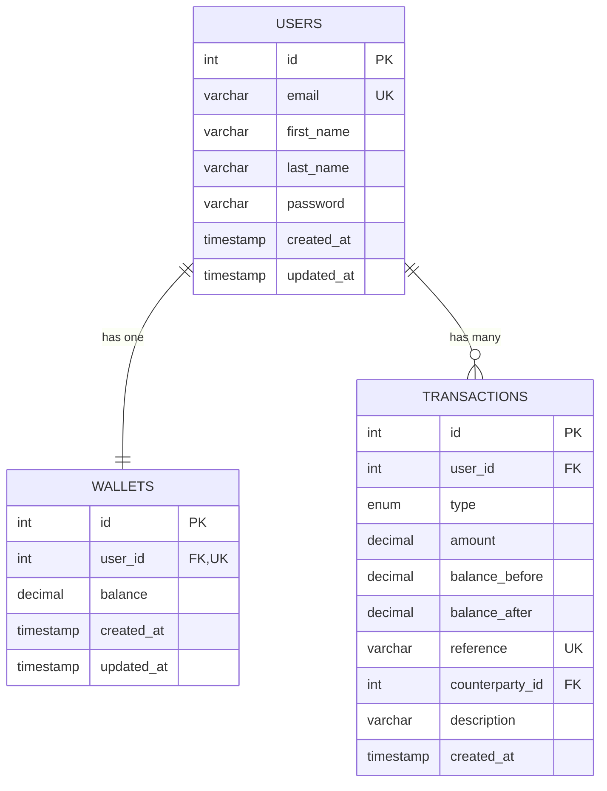

# Demo Credit — Lendsqr Wallet Service

A wallet service MVP for Lendsqr's Demo Credit mobile lending app. Borrowers use wallets to receive loans and make repayments.

## Tech Stack

- **Runtime**: Node.js (LTS) with TypeScript
- **Framework**: Express.js
- **ORM**: KnexJS
- **Database**: MySQL
- **Authentication**: JWT (faux token-based)
- **Validation**: Joi
- **Testing**: Jest with ts-jest

## Features

1. **User Registration** — Create an account with Adjutor Karma blacklist check
2. **User Login** — Faux token-based authentication
3. **Fund Account** — Deposit money into wallet
4. **Transfer Funds** — Send money to another user's wallet
5. **Withdraw Funds** — Withdraw money from wallet
6. **Transaction History** — View paginated transaction records

## E-R Diagram



### Database Design Decisions

- **DECIMAL(15,2)** for all monetary values — never floating point
- **One wallet per user** enforced via UNIQUE constraint on `wallets.user_id`
- **Double-entry bookkeeping** — transfers create two transaction records (debit + credit)
- **UUID references** on each transaction for idempotency
- **Immutable audit trail** — transaction records are append-only
- **Foreign keys** with proper referential integrity
- **Indexes** on `transactions.user_id` and `transactions.created_at` for query performance

## Project Structure

```
src/
├── app.ts                              # Express app setup
├── server.ts                           # Server entry point
├── config/
│   ├── index.ts                        # Environment configuration
│   └── knexfile.ts                     # Knex database configuration
├── database/
│   ├── db.ts                           # Knex singleton instance
│   └── migrations/
│       └── 20260330_create_tables.ts   # Database schema migration
├── middleware/
│   ├── auth.middleware.ts              # JWT token verification
│   ├── validate.middleware.ts          # Joi request validation
│   └── error.middleware.ts             # Global error handler
├── modules/
│   ├── auth/
│   │   ├── auth.routes.ts
│   │   ├── auth.controller.ts
│   │   ├── auth.service.ts
│   │   ├── auth.validation.ts
│   │   └── auth.service.test.ts
│   ├── wallet/
│   │   ├── wallet.routes.ts
│   │   ├── wallet.controller.ts
│   │   ├── wallet.service.ts
│   │   ├── wallet.validation.ts
│   │   └── wallet.service.test.ts
│   └── transaction/
│       ├── transaction.routes.ts
│       ├── transaction.controller.ts
│       ├── transaction.service.ts
│       └── transaction.service.test.ts
├── models/
│   ├── user.model.ts                   # User data access
│   ├── wallet.model.ts                 # Wallet data access (with FOR UPDATE)
│   └── transaction.model.ts            # Transaction data access
├── services/
│   └── adjutor.service.ts              # Lendsqr Adjutor Karma API client
├── utils/
│   ├── token.ts                        # JWT generate/verify
│   ├── http-error.ts                   # Custom HttpError class
│   └── response.ts                     # Standardized API responses
└── types/
    └── index.ts                        # Shared TypeScript interfaces
```

## Setup & Installation

### Prerequisites

- Node.js (LTS version)
- MySQL 8.0+
- npm

### 1. Clone the repository

```bash
git clone https://github.com/Olayanju-1234/lendsqr-assessment.git
cd lendsqr-assessment
```

### 2. Install dependencies

```bash
npm install
```

### 3. Configure environment variables

```bash
cp .env.example .env
```

Edit `.env` with your values:

```
PORT=3000
NODE_ENV=development

DB_HOST=localhost
DB_PORT=3306
DB_USER=root
DB_PASSWORD=your_password
DB_NAME=demo_credit

JWT_SECRET=your-secret-key

ADJUTOR_BASE_URL=https://adjutor.lendsqr.com/v2
ADJUTOR_API_KEY=your-adjutor-api-key
```

### 4. Create the database

```sql
CREATE DATABASE demo_credit;
```

### 5. Run migrations

```bash
npm run migrate
```

### 6. Start the server

```bash
# Development (with hot reload)
npm run dev

# Production
npm run build
npm start
```

### 7. Run tests

```bash
npm test
```

## API Documentation

Base URL: `http://localhost:3000/api`

### Health Check

```
GET /api/health
```

**Response** `200`
```json
{
  "status": "success",
  "message": "Demo Credit API is running",
  "timestamp": "2026-03-30T12:00:00.000Z"
}
```

---

### Authentication

#### Register

```
POST /api/auth/register
```

**Request Body**
```json
{
  "email": "john@example.com",
  "first_name": "John",
  "last_name": "Doe",
  "password": "password123"
}
```

**Response** `201`
```json
{
  "status": "success",
  "message": "User registered successfully",
  "data": {
    "id": 1,
    "email": "john@example.com",
    "token": "eyJhbGciOiJIUzI1NiIs..."
  }
}
```

**Error Responses**
- `400` — Validation error (invalid email, short password, etc.)
- `403` — User is on the Karma blacklist
- `409` — Email already registered

#### Login

```
POST /api/auth/login
```

**Request Body**
```json
{
  "email": "john@example.com",
  "password": "password123"
}
```

**Response** `200`
```json
{
  "status": "success",
  "message": "Login successful",
  "data": {
    "id": 1,
    "email": "john@example.com",
    "token": "eyJhbGciOiJIUzI1NiIs..."
  }
}
```

**Error Responses**
- `401` — Invalid email or password

---

### Wallet Operations

All wallet endpoints require authentication via Bearer token:

```
Authorization: Bearer <token>
```

#### Fund Account

```
POST /api/wallet/fund
```

**Request Body**
```json
{
  "amount": 5000.00
}
```

**Response** `200`
```json
{
  "status": "success",
  "message": "Account funded successfully",
  "data": {
    "balance": 5000.00,
    "reference": "550e8400-e29b-41d4-a716-446655440000"
  }
}
```

**Error Responses**
- `400` — Invalid amount (zero, negative, or exceeds limit)
- `401` — Authentication required

#### Transfer Funds

```
POST /api/wallet/transfer
```

**Request Body**
```json
{
  "recipient_email": "jane@example.com",
  "amount": 1000.00
}
```

**Response** `200`
```json
{
  "status": "success",
  "message": "Transfer successful",
  "data": {
    "balance": 4000.00,
    "reference": "550e8400-e29b-41d4-a716-446655440001"
  }
}
```

**Error Responses**
- `400` — Insufficient funds, transfer to self, or invalid amount
- `401` — Authentication required
- `404` — Recipient not found

#### Withdraw Funds

```
POST /api/wallet/withdraw
```

**Request Body**
```json
{
  "amount": 2000.00
}
```

**Response** `200`
```json
{
  "status": "success",
  "message": "Withdrawal successful",
  "data": {
    "balance": 2000.00,
    "reference": "550e8400-e29b-41d4-a716-446655440002"
  }
}
```

**Error Responses**
- `400` — Insufficient funds or invalid amount
- `401` — Authentication required

#### Check Balance

```
GET /api/wallet/balance
```

**Response** `200`
```json
{
  "status": "success",
  "message": "Success",
  "data": {
    "balance": 2000.00
  }
}
```

---

### Transaction History

```
GET /api/transactions?page=1&limit=20
```

**Query Parameters**
| Parameter | Type | Default | Description |
|-----------|------|---------|-------------|
| page | number | 1 | Page number |
| limit | number | 20 | Records per page (max 100) |

**Response** `200`
```json
{
  "status": "success",
  "message": "Success",
  "data": {
    "transactions": [
      {
        "id": 3,
        "user_id": 1,
        "type": "withdraw",
        "amount": -2000.00,
        "balance_before": 4000.00,
        "balance_after": 2000.00,
        "reference": "550e8400-e29b-41d4-a716-446655440002",
        "counterparty_id": null,
        "description": "Withdrawal",
        "created_at": "2026-03-30T12:05:00.000Z"
      },
      {
        "id": 2,
        "user_id": 1,
        "type": "transfer",
        "amount": -1000.00,
        "balance_before": 5000.00,
        "balance_after": 4000.00,
        "reference": "550e8400-e29b-41d4-a716-446655440001",
        "counterparty_id": 2,
        "description": "Transfer to jane@example.com",
        "created_at": "2026-03-30T12:03:00.000Z"
      }
    ],
    "page": 1,
    "limit": 20,
    "totalPages": 1,
    "totalRecords": 2
  }
}
```

## Architecture & Design Decisions

### Layered Architecture

```
Routes → Controllers → Services → Models → Database
```

- **Routes**: Map HTTP paths to controllers, apply validation middleware
- **Controllers**: Extract request data, call services, format responses (no business logic)
- **Services**: All business logic, transaction scoping, validation rules
- **Models**: Thin data access wrappers around KnexJS queries

### Transaction Scoping

All wallet mutations use MySQL transactions with pessimistic locking:

- **Fund/Withdraw**: `SELECT ... FOR UPDATE` on the wallet row, then update
- **Transfer**: Lock both wallets in ascending `user_id` order to prevent deadlocks, then debit sender and credit receiver atomically
- **Registration**: User + wallet creation in a single transaction (no orphaned records)

### Karma Blacklist Integration

- Checks the Lendsqr Adjutor API during registration
- **Fail-open strategy**: If the API is down or times out (5s), registration proceeds — prevents external dependency from blocking all signups
- Blacklisted users receive a `403 Forbidden` response

### Security

- Passwords hashed with bcrypt (10 salt rounds)
- JWT tokens with 24-hour expiry
- Passwords never returned in API responses
- Input validation on all endpoints via Joi schemas
- SQL injection prevented by KnexJS parameterized queries

## Testing

22 unit tests across 3 test suites:

```
PASS src/modules/auth/auth.service.test.ts (7 tests)
PASS src/modules/wallet/wallet.service.test.ts (12 tests)
PASS src/modules/transaction/transaction.service.test.ts (3 tests)
```

### Test Coverage

| Module | Positive Tests | Negative Tests |
|--------|---------------|----------------|
| Auth | Register, Login, API failure recovery | Blacklisted user, Duplicate email, Wrong password, Invalid email |
| Wallet | Fund, Transfer (dual-entry), Withdraw, Balance | Insufficient funds, Self-transfer, Recipient not found, Wallet not found |
| Transaction | Paginated history, Page calculation | Empty results |

All tests mock the database layer — no MySQL required to run tests.

## Scripts

| Command | Description |
|---------|-------------|
| `npm run dev` | Start development server with hot reload |
| `npm run build` | Compile TypeScript to JavaScript |
| `npm start` | Start production server |
| `npm test` | Run all unit tests |
| `npm run migrate` | Run database migrations |
| `npm run migrate:rollback` | Rollback last migration |

## Author

Joseph Olayanju
